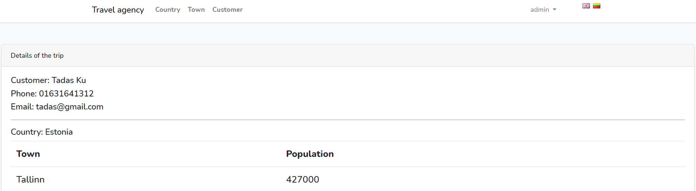

# Travel Agency project

This is a CRUD based Laravel Project created from scratch to manage the information of customers, towns and countries for a Travel Agency.
___
<br>

## Features

 :heavy_check_mark: Admin's Login Page <br>
 :heavy_check_mark: Adding New Country/Town/Customer <br>
 :heavy_check_mark: Deleting Country/Town/Customer <br>
 :heavy_check_mark: Updating Country/Town/Customer <br> 
 :heavy_check_mark: Database <br> 
 
 :heavy_check_mark: Internationalism (EN and LT languages) <br> 
 :heavy_check_mark: Filtering towns and clients by country <br>
 :heavy_check_mark: Searching towns by name <br>  
 :heavy_check_mark: WYSIWYG ("TinyMCE") text editor <br> 
 ___
<br>

## Installation

- In order to run the project you need to have ampps/xampp/wamp and database managing application installed (MySQL Workbench preferred) and **turned on**.
- If you have them just navigate to the main page of the repository and download (.zip file) or clone the project.
- Import file ("../database/schema/travel.sql") into MySQL Workbench in order to be able to use the existing database schema. This will create a new database named "travelsite2" with existing data.
- Open the terminal in projects root directory and type "composer install" or "php composer.phar install" (it depends if You have it installed globally or not).
- Navigate to **.env** file and set the correct database name and your password.
- Run the database migrations.
```bash
php artisan migrate
```
- In the terminal run php artisan serve.
___
<br>

## Usage

- Find and copy the server uri specified in the terminal(after the "php artisan serve" command). Paste it to your browser.
- In order to login use this email and password to login:

```bash
email: admin@admin.com
password: admin

```
___
</br>

## Screenshots
<div>

<br>

<br>

<br>

</div>

</div>

</div>

___